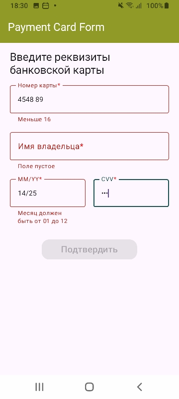
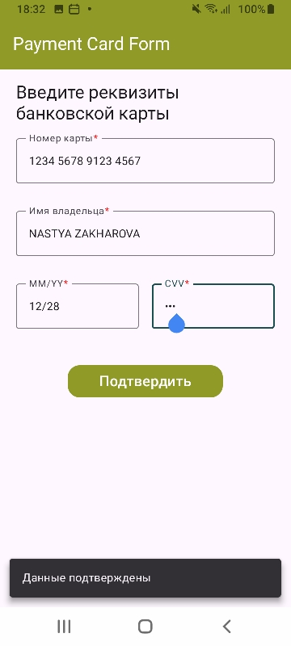

# PaymentCardForm
## Описание 
Приложение на Compose Multiplatform, реализующее форму ввода данных банковской карты.

Приложение демонстрирует:
- работу с Compose UI
- архитектуру MVVM
- валидацию пользовательского ввода
- управление состоянием через StateFlow
- форматирование ввода (номер карты, срок действия)

## Функциональность
- Ввод номера карты (16 цифр, формат 0000 0000 0000 0000)
- Ввод имени владельца (латиница + пробелы)
- Ввод срока действия карты (MM/YY) \
автоматическое форматирование \
проверка месяца (01–12) \
проверка года (≥ 2023)
- Ввод CVV (3 цифры, скрытый ввод)
- Валидация всех полей
- Кнопка «Подтвердить» активна только при корректных данных
- Snackbar с подтверждением при успешной отправке

## Запуск проекта
### Android
Для запуска приложения на устройстве/эмуляторе:
- откройте проект в Android Studio и запустите импортированную конфигурацию

Для сборки пакета приложений:  
 - запустите `./gradlew :AndroidApp:assembleDebug`  
 - найдите файл `.apk` в `AndroidApp/build/outputs/apk/debug/AndroidApp-debug.apk` 

### iOS
Чтобы запустить приложение на устройстве iPhone/симуляторе:  
 - Откройте `iosApp/iosApp.xcproject` в Xcode и запустите стандартную конфигурацию  
 - Или используйте [Kotlin Multiplatform Mobile plugin](https://plugins.jetbrains.com/plugin/14936-kotlin-multiplatform-mobile) для Android Studio 

## Скриншоты
 \
Форма ввода карты

 \
Валидация полей

 \
Успешное подтверждение